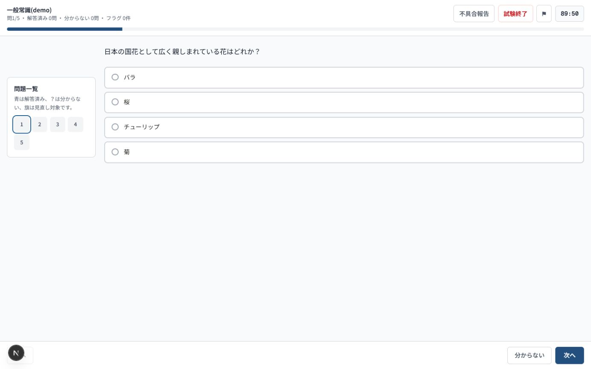
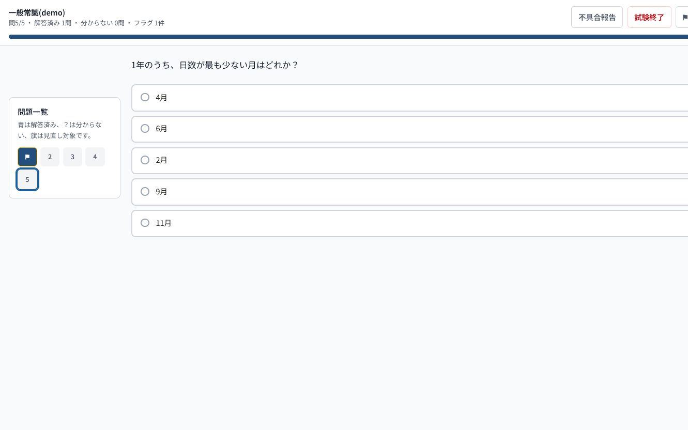
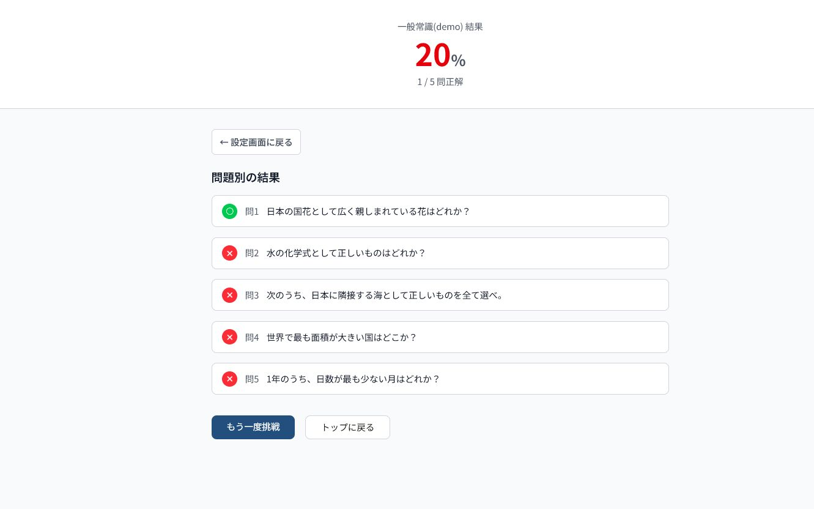
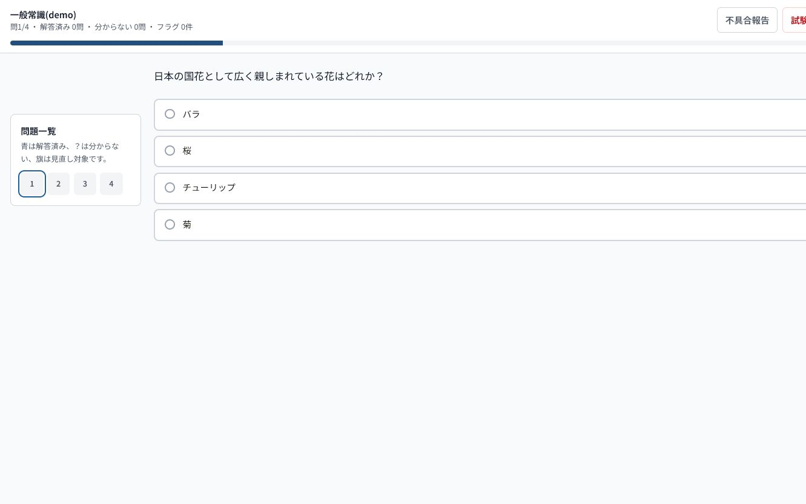
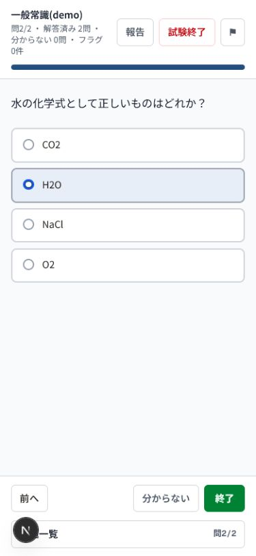

# 演習ページ 結合テスト・機能レビュー

- 実施日: 2026-08-05
- 対象: 演習選択、演習設定、試験モード、一問一答、採点、結果保存
- 基準ブランチ: `origin/main` を追跡する `fix/practice-flow-intent`
- 方針: 現行UI・本体機能は変更せず、結合テストとレビュー証跡だけを追加
- アクセシビリティ目標: WCAG 2.2 AA相当を想定

> 2026-08-06追記: この文書の問題数と出典状況は実施時点の記録である。SGの公式問題収録後の件数と照合結果は、[問題データと公式公開範囲の監査](question-source-audit-2026-08-06.md)を参照。

## 結論

問題配信時の正解秘匿、カテゴリ境界を守った単問採点、実データを使う一括採点、通常操作での試験結果保存は成立している。一方、利用者が設定した制限時間、試験終了の意思確認、一問一答の完了状態という主要な状態遷移に不一致がある。現時点では「設定どおりに受験し、意図したタイミングで安全に終了する」という中核体験を満たしていない。

最優先は、タイマー初期化、時間切れ処理、最終問題からの終了処理の3点である。いずれも見た目の改善ではなく、受験結果の信頼性に関わる。

## 想定する利用者の意図と充足状況

| ID | 利用者の意図 | 現状 | 根拠 |
|---|---|---|---|
| R1 | 設定したモード、問題数、範囲、順序、制限時間で開始したい | 一部不一致 | 問題数・ドメインは通常導線で反映。制限時間は30分設定でも90分から始まる挙動を再現 |
| R2 | 受験前に正解や解説を見せず、公正に採点してほしい | 充足 | Route Handler結合テストで単問・シナリオ双方の秘匿とカテゴリ境界を確認 |
| R3 | 回答、未回答、分からない、フラグを区別して見直したい | 一部充足 | 状態保持と問題一覧はあるが、終了前サマリーがなく、最終問題の「終了」は即採点 |
| R4 | 制限時間が来たら、定義済みの規則で試験を終了してほしい | 不一致 | 0秒でカウントが止まるだけで、回答ロックも自動採点も行わない |
| R5 | 一問一答では回答後に正誤と解説を確認し、完了を記録したい | 一部不一致 | 即時フィードバックは成立。完了直後の再読込で最終問題へ戻る |
| R6 | 結果と進捗をカテゴリ固有の基準で正しく残してほしい | 一部不一致 | 試験結果は保存するが、合格基準を65%に固定。一問一答は進捗保存なし |
| R7 | 通信失敗や不正なURLでも、原因と復帰方法を知りたい | 不一致 | `res.ok`確認と失敗状態がなく、空問題または読込中として見える |
| R8 | キーボードや支援技術でも選択状態を理解して操作したい | 一部不一致 | ボタン操作は可能だが、回答群のradio/checkbox意味と選択状態を公開していない |

## 状態モデル

```text
演習選択
  -> 設定（mode / count / timer / random / domains）
  -> 読込中（category API + question API）
  -> 受験中
       試験: 未回答 <-> 回答済み / 分からない / フラグ -> 一括採点 -> 結果
       一問一答: 未回答 -> 回答送信 -> 正誤・解説 -> 次問 -> 完了
  -> 保存
       受験中: sessionStorage
       試験結果: localStorage
```

現状の主な断絶は、設定から読込中へ進む際にカテゴリの制限時間が確定していないこと、一問一答の「正誤・解説」と「完了」が保存対象に含まれないこと、終了操作が2系統で異なることにある。

## 良い点

- `/api/questions` は通常問題とシナリオ問題のどちらからも `answer` と `explanation` を除外している。
- 単問採点は `categoryId` と `questionId` の組み合わせを検証し、別カテゴリの問題IDを404で拒否する。
- 一括採点は表示順へ並べ直して結果画面へ渡し、結果後にセッション状態を消去する。
- 設定画面は0問カテゴリを「準備中」として開始不能にし、通常操作では問題数を有効範囲に制限する。
- 回答、分からない、フラグ、現在位置を明示するナビゲーションは、見直しの基礎として機能している。

## 機能上の指摘

### P0 — 受験結果の信頼性を損なう

#### P0-1. 設定した制限時間ではなく90分で始まる

- 再現: 一般常識の設定画面で「制限時間あり（30分）」のまま開始すると、開始直後に `89:50` を表示した。
- 根拠: `ExamSession.tsx:43-56` でカテゴリ取得前に `5400` 秒をフックへ渡す。`useExamSession.ts:148-183` はその値でセッションを初期化・復元するため、後から取得した1800秒より先にフォールバック値が保存される競合が起きる。
- 影響: 設定内容と実際の受験条件が一致せず、時間制約を含む結果を信用できない。
- 推奨: カテゴリ取得完了後だけセッションを生成する。タイマー初期値は一つの所有者から一度だけ確定し、30分カテゴリが1800秒になる結合テストを追加する。

#### P0-2. 制限時間が0秒になっても試験が終わらない

- 根拠: `useExamSession.ts:196-212` は0でintervalを止めるだけで、回答ロック、確認、`finishExam`のいずれにも遷移しない。
- 影響: 制限時間後も回答・変更・手動採点ができ、「制限時間あり」の契約が成立しない。
- 推奨: `active -> time-expired -> submitting -> result` を明示し、0秒到達を一度だけ採点へ接続する。送信失敗時の再試行も別状態にする。

#### P0-3. 最終問題の「終了」は確認・見直しなしで即採点する

- 再現: 5問中1問だけ回答し、問5へ移動してフッターの「終了」を押すと、確認なしで20%の結果になった。
- 根拠: ヘッダーの「試験終了」は `ExamSession.tsx:166-180` の確認を通るが、フッターは `ExamSession.tsx:148-151` から直接 `finishExam` を呼ぶ。
- 影響: 「次へ」の位置に現れるボタンを進行操作として押しただけで、未回答を含む結果が確定する。操作意図と処理が一致しない。
- 推奨: 最終問題の主操作を終了前サマリーへ統一し、回答済み・未回答・分からない・フラグ件数を確認してから明示的に確定する。

Pearson/Certiportの公式チュートリアルでも、問題画面から `Go to Summary` へ進み、回答済み・未回答・マーク済みを見直した後に終了する構造になっている。模倣すべきなのは装飾ではなく、この誤終了を防ぐ状態遷移である。参考: [Certiport Next Generation Exam Tutorial (Pearson VUE)](https://certiport.pearsonvue.com/Educator-resources/Exam-details/Exam-tutorials/PMI_NG_Tutorial.pdf)

### P1 — 主要導線で誤解・消失・復帰不能を招く

#### P1-1. セッションURLの値を検証していない

- 再現: `count=-1` を指定しても拒否されず、一般常識の4問セッションとして開始した。
- 根拠: `session/page.tsx:33-40` が `mode` を型キャストし、`count` をそのまま `Number` 化し、domainsも実在確認せず渡す。負数では `slice(0, -1)` となる。
- 推奨: URL境界でmodeの列挙、countの有限整数・1以上・上限、domainの所属を検証し、無効時は設定画面へ理由付きで戻す。

#### P1-2. 読込・採点エラーを利用者へ返さない

- 根拠: `ExamSession.tsx:43-46` と `useExamSession.ts:119-190,299-382` は `res.ok` を確認せず、カテゴリ取得の失敗を握りつぶす。送信中、失敗、再試行状態もない。
- 影響: 通信失敗は無限の読込表示、404は「問題がありません」、採点失敗は壊れた結果または未処理例外になり得る。連打による重複送信も抑止しない。
- 推奨: `loading / active / submitting / error / finished` を明示し、操作を一時無効化しつつ再試行可能なエラーを表示する。

#### P1-3. 一問一答のフィードバックと完了を復元できない

- 再現: 2問目の正解後に「全問完了しました！」まで進み、再読込すると問2/2へ戻り、選択肢だけが残って正誤・解説・完了は消えた。
- 根拠: `SessionState` は問題、回答、現在位置、残り時間だけを持ち、`drillResult` と `finished` を保存しない。`nextDrill` で完了してもセッションを消去・結果保存しない。
- 推奨: 一問一答の仕様を「途中復帰する」か「完了時に破棄する」か決め、少なくとも回答済みフィードバックの再送防止と完了記録を一貫させる。

#### P1-4. カテゴリ別の合格点を結果表示が使っていない

- 根拠: `data/exams/*/meta.json` は60%、65%、75%を持つが、`ResultView.tsx:61-65` は65%で色だけを決める。
- 影響: 例えばAWS SCSの75%基準に対して65%を成功色で表示し、結果の意味を誤らせる。
- 推奨: APIまたはサーバー側で確定した`passingScore`を結果へ渡し、色だけでなく合否テキストでも示す。

#### P1-5. 複数選択を全解除した状態を「回答済み」と数える

- 根拠: `ChoiceGroup.tsx:39-44` は全解除時に `[]` を保存する一方、`ExamShell.tsx:52-54` と `QuestionNav.tsx:23-38` はnullでないものを回答済みとみなす。
- 影響: 見直し画面上は回答済みなのに採点は0点となる。
- 推奨: 空配列をnullへ正規化し、`isAnswered`を単一の共通関数に集約する。

### P2 — 品質・アクセシビリティ・データ整合性

#### P2-1. 進捗バーが「解答率」ではなく「現在位置」を表す

- 根拠: `ExamShell.tsx:57` は `(currentIndex + 1) / totalCount` を使用する。問5へ飛ぶだけで100%になる。
- 推奨: Pearson風の受験進捗を意図するなら回答済み率を表示し、現在位置は既存の問番号に任せる。

#### P2-2. 選択肢の意味と選択状態が支援技術へ伝わらない

- 根拠: `ChoiceGroup.tsx:82-153` は見た目だけのラジオ/チェックを内包するbutton列で、radiogroup/group、radio/checkbox、`aria-checked`または`aria-pressed`がない。
- 推奨: native input + fieldset/legend、または完全なARIA選択パターンへ置き換え、矢印キー・Tab・読み上げを検証する。

#### P2-3. 保存セッションが設定条件を識別しない

- 根拠: `SessionState` はmode、timerEnabled、randomEnabled、selectedDomainsを持たず、復元判定はカテゴリと問題ID列だけである。
- 影響: 直接URL変更や将来の導線追加時に、異なるモード・時間条件へ古い状態を持ち込める。
- 推奨: 設定の正規化済みfingerprintを保存し、完全一致したセッションだけ復元する。

#### P2-4. 未回答履歴を回答0として保存する

- 根拠: `storage.ts:65-77` は未回答の `null` を `0` に変換する。0は実在する先頭選択肢と区別できない。
- 推奨: `QuestionHistory.lastAnswer`をnullableにし、未回答をそのまま保存する。

#### P2-5. Java問題数の説明がデータ間で矛盾する

- 根拠: `data/categories.json:53` は全100問、`category-details.ts:121` とschema検証結果は全50問。
- 推奨: 問題数を説明文へ固定記述せず、実データ件数から表示するか、一つのメタ情報を唯一の情報源にする。

#### P2-6. モバイルの一問一答で進行操作が重複する

- 根拠: フィードバック内の「次の問題へ」と固定フッターの「次へ」が同時に存在し、長い解説の末尾が固定フッター下へ回り込む。
- 推奨: フィードバック後の主操作を一つにし、固定領域ぶんのscroll paddingを保証する。

## 結合テストで保証した範囲

追加した10件は、mockデータではなくリポジトリの実問題JSONと実Route Handlerを利用する。

- API 6件
  - 通常問題の正解・解説を秘匿
  - シナリオ構造を維持しつつ正解・解説を秘匿
  - 単問の正答と未回答を採点
  - 複数選択の部分正解を採点
  - 別カテゴリの問題IDを拒否
  - 表示対象2問だけを順序どおり一括採点
- UI 4件
  - 試験モード: 回答 -> 問題移動 -> 実API一括採点 -> 100%結果 -> localStorage保存 -> sessionStorage消去
  - 一問一答: 不正解フィードバック -> 次問 -> 正解フィードバック -> 完了
  - 試験モード: 回答と現在位置を再マウント後にsessionStorageから復元
  - 一問一答: 未回答を明示 -> 正解と解説を表示

Next.js公式も、コンポーネントの統合確認とブラウザーE2Eを目的別に分ける構成を案内している。今回は既存のVitest基盤で結合境界を固定し、依存追加なしの実ブラウザー確認で状態遷移を補った。参考: [Next.js Testing Guide](https://nextjs.org/docs/app/guides/testing)

## ブラウザー証跡

### 30分設定に対して89:50で開始



### 1/5回答のまま最終問題へ移動し、確認なしで20%結果へ遷移





### 不正なcountと一問一答の再読込





ほかの証跡は `artifacts/practice-audit-2026-08-05/` に保存した。

## 検証結果

| 検証 | 結果 |
|---|---|
| 追加結合テスト単体実行 | 2 files / 10 tests passed |
| 既存を含む全テスト | pass。9 files / 42 tests |
| 問題schema・件数検証 | pass。8カテゴリ中、SG 108、SC 12、THM 20、Java 50、General 5。LPIC 101/102とAWS SCSは0問で、選択画面では準備中として開始不能 |
| ESLint | pass |
| Next.js production build | pass。Next.js 16.2.9、45ページ生成、演習関連routeを含む全route確定 |
| ブラウザーconsole | エラーなし。`scroll-behavior: smooth`に対するNext.js警告が1種 |

## 証拠の限界

- タイマー0秒到達はコード分岐を確認したが、30分待機による実時間E2Eは行っていない。
- Chrome系ブラウザーのdesktopと390 x 844 viewportを確認した。Safari、Firefox、実機、スクリーンリーダーは未確認。
- 通信断、API 500、二重クリック、localStorage容量超過は未実行で、コードレビューによる指摘である。
- Playwright等の永続E2E基盤は今回追加していない。

## 推奨する修正順

1. カテゴリ取得後にだけセッションを開始し、設定どおりのタイマー初期値を保証する。
2. 0秒到達を一度だけ自動採点へ接続し、回答操作をロックする。
3. 最終問題の「終了」を終了前サマリーへ統一し、未回答を明示して確定させる。
4. fetchのpending/error/retryと二重送信防止を状態モデルへ追加する。
5. 一問一答の復元・完了・進捗保存仕様を一つに決める。
6. 合格基準、回答済み判定、未回答履歴を各データの唯一の情報源へ統合する。
7. 選択肢セマンティクス、進捗の意味、モバイル固定フッターを整える。

修正時はP0ごとに失敗する回帰テストを先に追加し、1件ずつ状態遷移を固定する。
